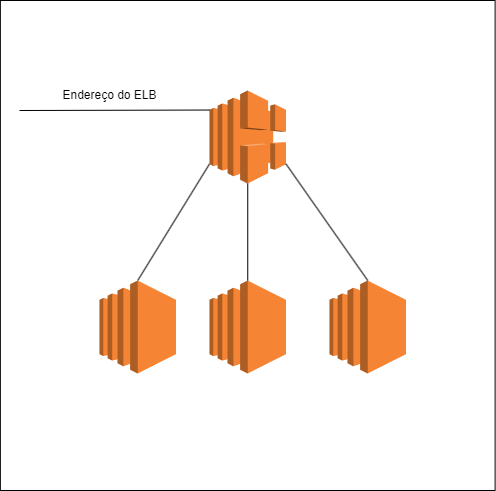

# Projeto-ComputacaoEmNuvem-ELB
Feito por Diogo Duarte

## Sobre
Neste repositório se encontra o Projeto Final da matéria Computação em Nuvem do sexto semestre de Engenharia de Computação na faculdade Insper. O objetivo deste projeto é criar uma infraestrutura que utilizaria como principal componente o Elastic Load Balancer (ELB). A descrição da infraestrura é ter um Elastic Load Balancer que iria admnistrar o tráfego de 3 máquinas (EC2). Segue o diagrama da infraestrutura abaixo.

## Diagrama Arquitetural

## Tecnologias

