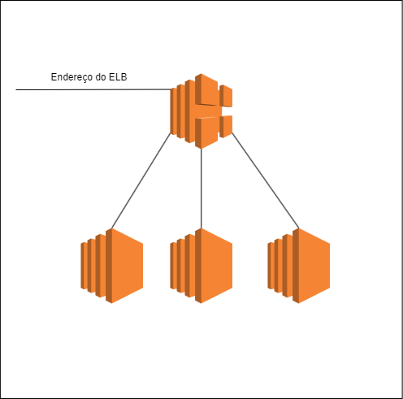
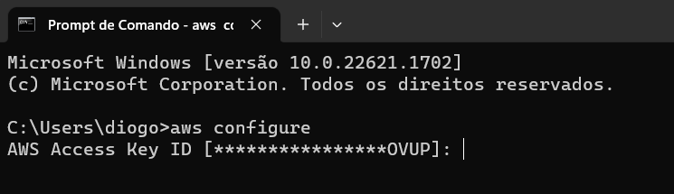
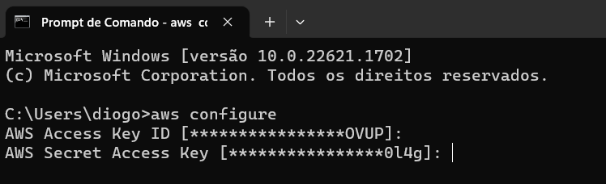
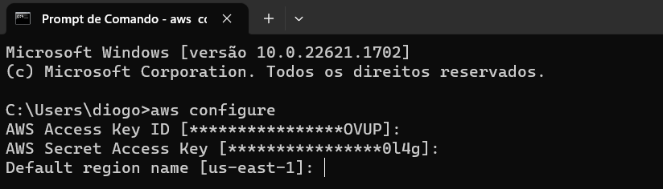
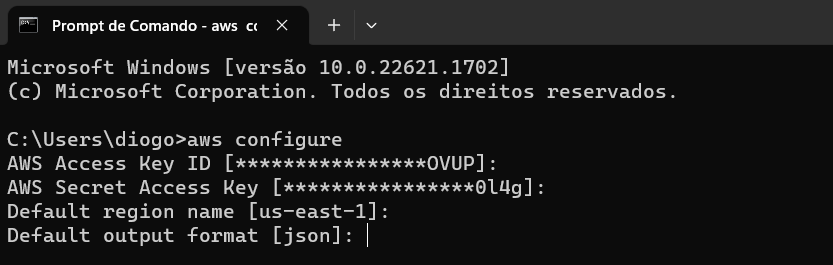

# Projeto-ComputacaoEmNuvem-ELB
Feito por Diogo Duarte

## Sobre
Neste repositório se encontra o Projeto Final da matéria Computação em Nuvem do sexto semestre de Engenharia de Computação na faculdade Insper. O objetivo deste projeto é criar uma infraestrutura que utilizaria como principal componente o Elastic Load Balancer (ELB). A descrição da infraestrura é ter um Elastic Load Balancer que iria admnistrar o tráfego de 3 máquinas (EC2). Segue o diagrama da infraestrutura abaixo.

## Diagrama Arquitetural



## Conceito do Projeto

Este projeto corresponde ao conceito C+ do projeto, em que consiste em ter um ambiente funcionando apenas em uma região por meio de código e documentação.

## Pré-Requisitos

- 

- 

- Conta na AWS

- Ter um usuário criado na AWS (AWS IAM User)

- Ter uma imagem que tenha algum serviço de Elastic Load Balancer (Exemplo: nginx configurado)

## Começando o projeto 

### Instalando o Terraform

Para a instalação do Terraform, siga este tutorial, feito pela própria HashiCorp, disponível neste link: https://developer.hashicorp.com/terraform/tutorials/aws-get-started/install-cli

Para verificar se a instalação funcionou, basta escrever no seu terminal:
```bash
terraform --version
```
Se não obteve erro, deu certo!!

### Instalando o Amazon CLI

Para a instalação do Amazon CLI, siga este tutorial disponível neste link: https://docs.aws.amazon.com/cli/latest/userguide/getting-started-install.html

Para verificar se a instalação funcionou, basta escrever no seu terminal:
```bash
aws --version
```
Se não obteve erro, deu certo!!

### Credenciais

Após ter feito a instalação dos dois principais recursos para montar a infraestrutura de ELB, será necessário fazer suas credenciais da AWS para conseguir ter acesso aos recursos da Amazon. Se não tiver criado seu usuário na AWS no IAM User, faça isso. 

Após a criação do usuário, será necessário criar as suas chaves de acesso, que serão necessárias para você fazer o credenciamento da sua máquina, para poder usufruir dos recursos da Amazon. Para isso, vá para o serviço IAM da AWS. Em seguida, vá em Users > Security Credentials > Create Acess Key. Ao clicar neste botão, você estará criando suas credenciais, que fará a conexão com sua conta da AWS. Será criado dois elementos, a sua AWS Acess Key ID e a sua AWS Secret Acess Key. Aviso: não compartilhe estes dados com ninguém, não deixe em um arquivo compartilhado em plain text. Para contornar isso, pode criar variáveis de ambiente, ou pelo AWS CLI.

### Configurando pela AWS CLI via terminal

Para configurar pela AWS CLi via terminal, digite este comando no seu prompt:
```bash
aws configure
```
Após digitar este comando, você colocará sua AWS Acess Key ID que foi criada agora pouco. 


Depois de lidar com a AWS Acess Key ID, será pedido para colocar a sua AWS Secret Acess Key


Em seguida, será pedido a região padrão


Por fim, o formato padrão de output de informação


Após preencher estes campos, as credenciais estarão definidas e você poderá interagir com os serviços da AWS.

## Executando o projeto

Após fazer as preparações do projeto, estamos prontos para comecar a construir a infraestrutura. Primeiramente, clone o repositório. Nele já está quase tudo pronto, será necessário fazer apenas uma mudança em um arquivo para tudo funcionar. No arquivo Principal/main.tf, na linha 113, se encontra uma variável chamada ami, a qual será onde você colocará a sua imagem criada com o seu serviço de ELB funcionando, por exemplo no arquivo está configurada a minha imagem que possui o serviço de ELB. 

Após você fazer esta mudança, acesse a pasta principal e dê os seguintes comandos. Estes comandos irão montar a infraestrutura para na AWS.

```bash
# Comece baixando as dependências do projeto:
$ terraform init

# Para vermos o que será utilizado na infraestrutura:
$ terraform plan

# Para subirmos a infraestrutura:
$ terraform apply
```

## Testando


## Destruindo o projeto

```bash
# Depois de usar a infraestrutura, temos que destruí-la:
$ terraform destroy
```

## Referências

- https://github.com/terraform-aws-modules/terraform-aws-elb/tree/master

- https://registry.terraform.io/

